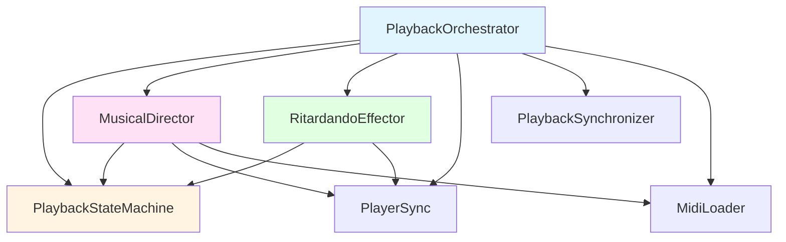

# PlaybackEngine Decomposition - Architectural Plan

## Executive Summary

This document provides a detailed architectural plan for decomposing the `PlaybackEngine` class into smaller, more focused components following the Single Responsibility Principle (SRP). The refactoring addresses the "God Class" code smell identified in the current implementation.

**Current State:** `PlaybackEngine` (263 lines) handles state management, ritardando effects, musical direction interpretation, and playback orchestration.

**Target State:** Four focused classes, each with a single, well-defined responsibility.

---

## Current Architecture Analysis

### PlaybackEngine Responsibilities (Violations of SRP)

1. **State Management** - Manages 5 boolean flags (`playingIntro_`, `ritardando_`, `lastVerse_`, `alFine_`, `displayWarnings_`)
2. **Ritardando Effects** - Handles gradual tempo slowdown via heartbeat callback
3. **Musical Direction Interpretation** - Processes MIDI meta-events (markers) for musical directions
4. **Playback Orchestration** - Coordinates intro and verse playback sequences
5. **Callback Setup** - Configures player callbacks

### Dependencies

```
PlaybackEngine
├── cxxmidi::player::PlayerSync& (player control)
├── PlaybackSynchronizer& (thread synchronization)
└── MidiLoader& (file metadata)
```

---

## Target Architecture Design

### Class Decomposition Overview



### 1. PlaybackStateMachine

**Responsibility:** Centralized playback state management

**Rationale:** State flags are scattered throughout PlaybackEngine and accessed/modified in multiple methods. Centralizing them provides:
- Single source of truth for playback state
- Clear state transitions
- Easier testing and debugging
- Thread-safe state access if needed in future

**Interface:**
```cpp
class PlaybackStateMachine {
public:
    // State getters
    bool isPlayingIntro() const;
    bool isRitardando() const;
    bool isLastVerse() const;
    bool isAlFine() const;
    bool shouldDisplayWarnings() const;
    
    // State setters
    void setPlayingIntro(bool playing);
    void setRitardando(bool active);
    void setLastVerse(bool isLast);
    void setAlFine(bool active);
    void setDisplayWarnings(bool display);
    
    // Composite state operations
    void reset();  // Reset all flags to initial state
    
private:
    bool playingIntro_{false};
    bool ritardando_{false};
    bool lastVerse_{false};
    bool alFine_{false};
    bool displayWarnings_{false};
};
```

**Migration Impact:** LOW - Simple refactoring of member variable access patterns

---

### 2. RitardandoEffector

**Responsibility:** Apply gradual tempo slowdown (ritardando effect)

**Rationale:** The ritardando logic is self-contained with specific timing constants and speed modification logic. Extracting it:
- Isolates timing-sensitive code
- Makes the decrement rate configurable (future: from MIDI file or CLI)
- Simplifies testing of ritardando behavior
- Reduces coupling in main orchestrator

**Interface:**
```cpp
class RitardandoEffector {
public:
    RitardandoEffector(cxxmidi::player::PlayerSync& player,
                       PlaybackStateMachine& stateMachine,
                       float decrementRate = RITARDANDO_DECREMENT);
    
    // Called from player heartbeat callback
    void handleHeartbeat();
    
    // Configuration
    void setDecrementRate(float rate);
    float getDecrementRate() const;
    
private:
    cxxmidi::player::PlayerSync& player_;
    PlaybackStateMachine& stateMachine_;
    float decrementRate_;
    
    static constexpr int64_t HEARTBEAT_CHECK_INTERVAL = 100000;
    static constexpr float RITARDANDO_DECREMENT = 0.002f;
};
```

**Key Design Decision:** The effector checks `stateMachine_.isRitardando()` to determine if it should apply the effect. This maintains the single source of truth for state while keeping the effect logic isolated.

**Migration Impact:** LOW - Direct extraction of `heartbeatCallback()` logic

---

### 3. MusicalDirector

**Responsibility:** Interpret MIDI meta-events and execute musical directions

**Rationale:** Musical direction processing (markers like "]", "\\", "D.C. al Fine", "Fine") has complex logic with multiple helper methods. This is a cohesive unit of functionality that:
- Interprets musical intent from MIDI markers
- Controls player behavior based on musical structure
- Maintains intro segment iteration state
- Has domain-specific knowledge (musical terminology)

**Interface:**
```cpp
class MusicalDirector {
public:
    MusicalDirector(cxxmidi::player::PlayerSync& player,
                    PlaybackStateMachine& stateMachine,
                    const MidiLoader& midiLoader);
    
    // Main event handler (called from player event callback)
    bool handleEvent(cxxmidi::Event& event);
    
private:
    // Dependencies
    cxxmidi::player::PlayerSync& player_;
    PlaybackStateMachine& stateMachine_;
    const MidiLoader& midiLoader_;
    
    // State
    std::vector<IntroductionSegment>::const_iterator currentIntroSegment_;
    
    // Event processing helpers
    void processIntroMarker(const cxxmidi::Message& message);
    void processRitardandoMarker(const cxxmidi::Message& message);
    bool processDCAlFineMarker(const cxxmidi::Message& message);
    bool processFineMarker(const cxxmidi::Message& message);
    
    // Musical direction markers
    static constexpr const char* INTRO_END = "]";
    static constexpr const char* RITARDANDO_INDICATOR = R"(\)";
    static constexpr const char* D_C_AL_FINE = "D.C. al Fine";
    static constexpr const char* FINE_INDICATOR = "Fine";
};
```

**Key Design Decisions:**
1. **Owns intro segment iterator:** This state is only used by intro marker processing
2. **Returns bool from handleEvent:** Maintains compatibility with player callback signature
3. **Accesses MidiLoader:** For intro segments, verbose flag, stuck note detection

**Migration Impact:** MEDIUM - Requires careful extraction of conditional logic from `eventCallback()`

---

### 4. PlaybackOrchestrator (Renamed PlaybackEngine)

**Responsibility:** High-level playback coordination and callback delegation

**Rationale:** After extracting specific responsibilities, the orchestrator becomes a pure coordinator:
- Owns and composes specialized components
- Sets up player callbacks that delegate to specialists
- Manages high-level playback flow (intro → verses)
- Provides public API for main()

**Interface:**
```cpp
class PlaybackOrchestrator {
public:
    PlaybackOrchestrator(cxxmidi::player::PlayerSync& player,
                         PlaybackSynchronizer& synchronizer,
                         const MidiLoader& midiLoader);
    
    ~PlaybackOrchestrator() = default;
    
    // Disable copy/move
    PlaybackOrchestrator(const PlaybackOrchestrator&) = delete;
    PlaybackOrchestrator& operator=(const PlaybackOrchestrator&) = delete;
    
    // Public API
    void initialize();
    void displayPlaybackInfo() const;
    void executePlayback();
    void setDisplayWarnings(bool display);
    
private:
    // === Dependencies ===
    cxxmidi::player::PlayerSync& player_;
    PlaybackSynchronizer& synchronizer_;
    const MidiLoader& midiLoader_;
    
    // === Owned Components ===
    PlaybackStateMachine stateMachine_;
    MusicalDirector musicalDirector_;
    RitardandoEffector ritardandoEffector_;
    
    // === Timing State ===
    float baseSpeed_{1.0f};
    float baseTempo_{1.0f};
    
    // === Callback Handlers (delegate to components) ===
    void heartbeatCallback();   // Delegates to ritardandoEffector_
    bool eventCallback(cxxmidi::Event& event);  // Delegates to musicalDirector_
    void finishedCallback();    // Signals synchronizer_
    
    // === Playback Flow Methods ===
    void playIntroduction();
    void playVerses();
    void setPlayerSpeed(float speedMultiplier);
    
    // === Constants ===
    static constexpr int VERSE_DISPLAY_OFFSET = 1;
};
```

**Key Design Decisions:**
1. **Component ownership:** Orchestrator owns all three specialized classes
2. **Dependency injection:** All components receive references they need via constructor
3. **Simplified callbacks:** Callbacks become simple delegation to owned components
4. **Retained timing state:** `baseSpeed_` and `baseTempo_` remain in orchestrator as they're used across multiple methods

**Migration Impact:** MEDIUM - Class rename + component instantiation + method simplification

---

## Implementation Strategy

### Step-by-Step Refactoring Plan

#### Step 1: Create PlaybackStateMachine (30 minutes)

**Files to create:**
- `playback_state_machine.hpp`
- `playback_state_machine.cpp`

**Implementation details:**
```cpp
// playback_state_machine.hpp
#pragma once

namespace MidiPlay {

class PlaybackStateMachine {
public:
    PlaybackStateMachine() = default;
    ~PlaybackStateMachine() = default;
    
    // Getters
    bool isPlayingIntro() const { return playingIntro_; }
    bool isRitardando() const { return ritardando_; }
    bool isLastVerse() const { return lastVerse_; }
    bool isAlFine() const { return alFine_; }
    bool shouldDisplayWarnings() const { return displayWarnings_; }
    
    // Setters
    void setPlayingIntro(bool playing) { playingIntro_ = playing; }
    void setRitardando(bool active) { ritardando_ = active; }
    void setLastVerse(bool isLast) { lastVerse_ = isLast; }
    void setAlFine(bool active) { alFine_ = active; }
    void setDisplayWarnings(bool display) { displayWarnings_ = display; }
    
    // Composite operations
    void reset() {
        playingIntro_ = false;
        ritardando_ = false;
        lastVerse_ = false;
        alFine_ = false;
    }
    
private:
    bool playingIntro_{false};
    bool ritardando_{false};
    bool lastVerse_{false};
    bool alFine_{false};
    bool displayWarnings_{false};
};

} // namespace MidiPlay
```

**Testing approach:** Simple unit tests for getter/setter pairs and reset()

---

#### Step 2: Create RitardandoEffector (45 minutes)

**Files to create:**
- `ritardando_effector.hpp`
- `ritardando_effector.cpp`

**Implementation details:**
```cpp
// ritardando_effector.hpp
#pragma once

#include <cxxmidi/player/player_sync.hpp>
#include "playback_state_machine.hpp"

namespace MidiPlay {

class RitardandoEffector {
public:
    RitardandoEffector(cxxmidi::player::PlayerSync& player,
                       PlaybackStateMachine& stateMachine,
                       float decrementRate = RITARDANDO_DECREMENT);
    
    void handleHeartbeat();
    
    void setDecrementRate(float rate) { decrementRate_ = rate; }
    float getDecrementRate() const { return decrementRate_; }
    
private:
    cxxmidi::player::PlayerSync& player_;
    PlaybackStateMachine& stateMachine_;
    float decrementRate_;
    
    static constexpr int64_t HEARTBEAT_CHECK_INTERVAL = 100000;
    static constexpr float RITARDANDO_DECREMENT = 0.002f;
};

} // namespace MidiPlay
```

```cpp
// ritardando_effector.cpp
#include "ritardando_effector.hpp"

namespace MidiPlay {

RitardandoEffector::RitardandoEffector(cxxmidi::player::PlayerSync& player,
                                       PlaybackStateMachine& stateMachine,
                                       float decrementRate)
    : player_(player)
    , stateMachine_(stateMachine)
    , decrementRate_(decrementRate)
{
}

void RitardandoEffector::handleHeartbeat() {
    if (stateMachine_.isRitardando()) {
        int64_t count = player_.CurrentTimePos().count();
        if (count % HEARTBEAT_CHECK_INTERVAL == 0) {
            float currentSpeed = player_.GetSpeed();
            currentSpeed -= decrementRate_;
            player_.SetSpeed(currentSpeed);
        }
    }
}

} // namespace MidiPlay
```

**Testing approach:** Verify heartbeat logic with mock player and state machine

---

#### Step 3: Create MusicalDirector (1.5 hours)

**Files to create:**
- `musical_director.hpp`
- `musical_director.cpp`

**Implementation details:**
- Extract all `process*Marker()` methods from PlaybackEngine
- Move intro segment iterator to MusicalDirector
- Implement `handleEvent()` with same conditional logic as current `eventCallback()`
- Move musical direction constants (INTRO_END, etc.) into this class

**Critical migration notes:**
- `handleEvent()` returns bool (true = send event, false = suppress)
- Must access `midiLoader_` for intro segments, verbose flag, stuck note detection
- Updates state via `stateMachine_` (e.g., `setRitardando(true)`)

---

#### Step 4: Refactor PlaybackEngine → PlaybackOrchestrator (2 hours)

**Files to modify:**
- Rename `playback_engine.hpp` → `playback_orchestrator.hpp`
- Rename `playback_engine.cpp` → `playback_orchestrator.cpp`

**Changes:**
1. **Class rename:** `PlaybackEngine` → `PlaybackOrchestrator`
2. **Add component members:**
   ```cpp
   PlaybackStateMachine stateMachine_;
   MusicalDirector musicalDirector_;
   RitardandoEffector ritardandoEffector_;
   ```
3. **Update constructor:** Initialize components with proper dependencies
4. **Simplify callbacks:**
   - `heartbeatCallback()` → `ritardandoEffector_.handleHeartbeat()`
   - `eventCallback()` → `return musicalDirector_.handleEvent(event)`
5. **Update state access:** Replace direct state access with `stateMachine_` calls
6. **Remove extracted code:** Delete helper methods now in MusicalDirector

---

#### Step 5: Update play.cpp (15 minutes)

**Changes:**
```cpp
// Before
#include "playback_engine.hpp"
MidiPlay::PlaybackEngine playbackEngine(player, synchronizer, midiLoader);

// After
#include "playback_orchestrator.hpp"
MidiPlay::PlaybackOrchestrator playbackOrchestrator(player, synchronizer, midiLoader);
```

Update all references from `playbackEngine` to `playbackOrchestrator`.

---

## Build System Updates

**Files to modify:**
- `.vscode/tasks.json` - Add new source files to compilation

**New files to compile:**
- `playback_state_machine.cpp`
- `ritardando_effector.cpp`
- `musical_director.cpp`
- `playback_orchestrator.cpp` (renamed from `playback_engine.cpp`)

---

## Testing Strategy

### Unit Testing Approach

1. **PlaybackStateMachine:** Test all getters, setters, and reset()
2. **RitardandoEffector:** Test heartbeat logic with different state conditions
3. **MusicalDirector:** Test each marker type processing with mock events
4. **PlaybackOrchestrator:** Integration tests for complete playback flow

### Integration Testing

Test complete playback scenarios:
- Simple playback (no intro, single verse)
- Multi-verse playback with pauses
- Introduction playback with markers
- Ritardando in intro and last verse
- D.C. al Fine handling
- Ctrl+C signal handling during various states

### Regression Testing

Verify all existing functionality:
- Verse count override (-n, -x flags)
- PlayIntro flag (-p flag)
- Speed and tempo overrides
- Device detection and configuration
- Signal handling (Ctrl+C)

---

## Risk Assessment

### Low Risk Areas
- PlaybackStateMachine creation - Simple data structure
- RitardandoEffector extraction - Isolated logic

### Medium Risk Areas
- MusicalDirector extraction - Complex conditional logic
- Orchestrator callback delegation - Must maintain exact behavior

### High Risk Areas
- None identified - refactoring is straightforward extraction

### Mitigation Strategies
1. **Incremental commits:** Each step is a separate commit
2. **Compile after each step:** Ensure no build breaks
3. **Preserve exact behavior:** No functional changes, only structural
4. **Test thoroughly:** Run all integration tests after each major step

---

## Benefits Analysis

### Code Quality Improvements
- **Reduced complexity:** Each class has <100 lines instead of 263
- **Improved testability:** Each component can be tested independently
- **Better cohesion:** Each class has one clear purpose
- **Lower coupling:** Dependencies are explicit via constructor injection

### Maintainability Improvements
- **Easier debugging:** Issues isolated to specific components
- **Simpler modifications:** Changes to ritardando logic don't affect musical direction processing
- **Clearer intent:** Class names communicate purpose (MusicalDirector vs generic PlaybackEngine)

### Future Extensibility
- **Configurable ritardando:** Easy to add CLI or MIDI file configuration
- **Additional effects:** New effector classes can be added (e.g., AccelerandoEffector)
- **Musical direction expansion:** New markers can be added to MusicalDirector
- **State persistence:** PlaybackStateMachine could be extended for save/resume

---

## Architectural Principles Applied

1. **Single Responsibility Principle (SRP):** Each class has one reason to change
2. **Open/Closed Principle:** Components are open for extension (inheritance) but closed for modification
3. **Dependency Inversion:** High-level orchestrator depends on abstractions (interfaces of components)
4. **Composition over Inheritance:** Orchestrator composes specialized components
5. **RAII:** All resources managed through constructor/destructor pairs

---

## Timeline Estimate

| Step | Description | Estimated Time |
|------|-------------|----------------|
| 1 | Create PlaybackStateMachine | 30 minutes |
| 2 | Create RitardandoEffector | 45 minutes |
| 3 | Create MusicalDirector | 1.5 hours |
| 4 | Refactor to PlaybackOrchestrator | 2 hours |
| 5 | Update play.cpp | 15 minutes |
| 6 | Build system updates | 15 minutes |
| 7 | Testing and validation | 1 hour |
| **Total** | | **6 hours** |

---

## Post-Refactoring Actions

1. **Update documentation:** Revise component_diagram.md to reflect new architecture
2. **ConPort logging:** Log architectural decision and refactoring completion
3. **Update TODO list:** Mark Part 1 steps as complete in todo.md
4. **Installer update:** Rebuild installer package with new structure
5. **Version bump:** Consider incrementing to v1.5.7 or v1.6.0

---

## Conclusion

This refactoring addresses the PlaybackEngine "God Class" smell by decomposing it into four focused classes, each adhering to the Single Responsibility Principle. The resulting architecture is more maintainable, testable, and extensible while preserving all existing functionality. The implementation can be completed incrementally with low risk and clear validation steps.