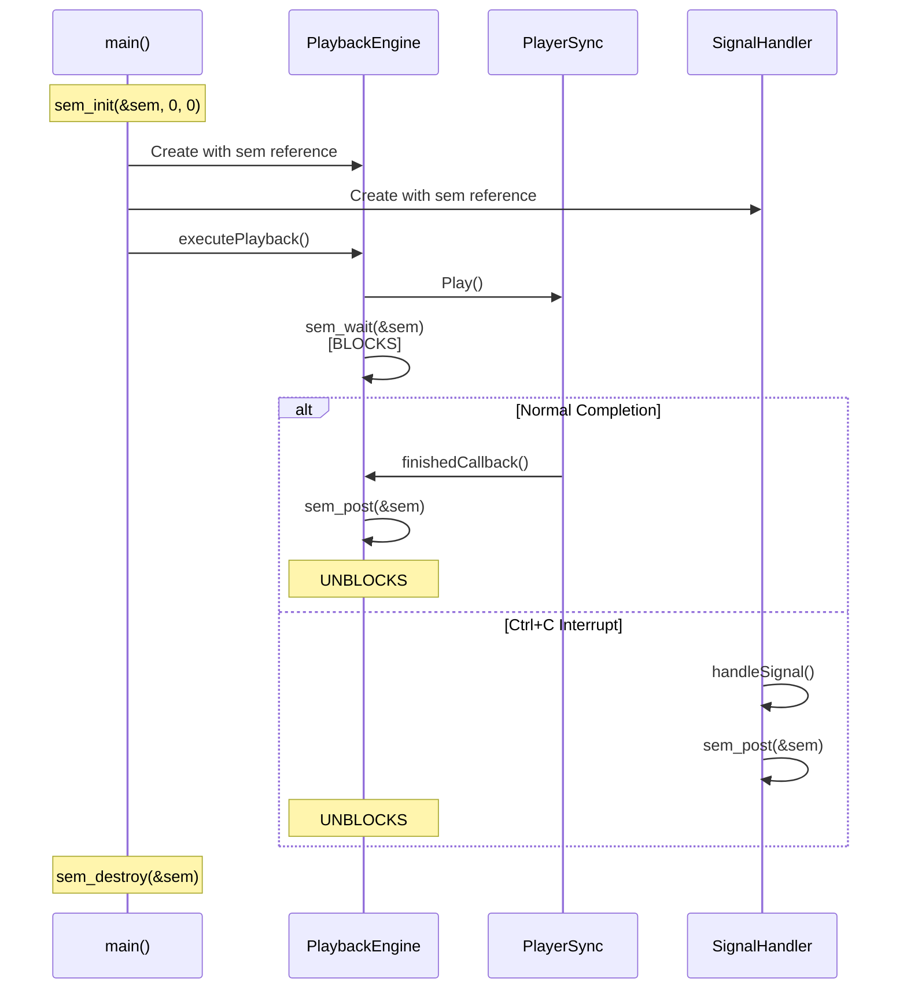

# Synchronization Modernization Design Document

## Executive Summary

This document describes the architectural design for modernizing the MidiPlay synchronization system from POSIX semaphores to standard C++ synchronization primitives (`std::condition_variable` and `std::mutex`). This change:

- **Eliminates** the last remaining global variable (`sem_t sem`)
- **Improves** portability (standard C++ vs POSIX-specific)
- **Enhances** exception safety through RAII
- **Maintains** all existing functionality with zero user-visible changes

**Estimated Effort**: 3-4 hours
**Risk Level**: Low (well-defined replacement, existing patterns)
**Testing Required**: Medium (playback scenarios + signal handling)

---

## Current Implementation Analysis

### 1. POSIX Semaphore Usage Pattern

#### Location: [`play.cpp`](play.cpp:38-40)
```cpp
sem_t sem;  // Global variable - Line 38

int main(int argc, char **argv) {
    int ret = sem_init(&sem, 0, 0);  // Line 50
    // ... setup code ...
    
    // Pass to components
    PlaybackEngine playbackEngine(player, sem, midiLoader);  // Line 131
    SignalHandler signalHandler(outport, sem, ...);          // Line 139
    
    ret = sem_destroy(&sem);  // Line 149
}
```

#### Location: [`playback_engine.cpp`](playback_engine.cpp:12-16)
```cpp
class PlaybackEngine {
public:
    PlaybackEngine(player::PlayerSync& player,
                   sem_t& semaphore,           // POSIX semaphore reference
                   const MidiLoader& midiLoader);
private:
    sem_t& semaphore_;
};
```

**Wait Operations** (blocking until playback completes):
- [`playback_engine.cpp:145`](playback_engine.cpp:145) - After intro playback
- [`playback_engine.cpp:181`](playback_engine.cpp:181) - After each verse
- [`playback_engine.cpp:196`](playback_engine.cpp:196) - After D.C. al Fine

**Post Operations** (signal playback completion):
- [`playback_engine.cpp:126`](playback_engine.cpp:126) - In finishedCallback()
- [`signal_handler.cpp:65`](signal_handler.cpp:65) - On Ctrl+C interrupt

### 2. Synchronization Flow Diagram



### 3. Current Problems

| Issue | Impact | Severity |
|-------|--------|----------|
| **Global State** | Violates encapsulation, harder to test | High |
| **POSIX-Specific** | Non-portable (Linux/Unix only) | Medium |
| **No RAII** | Manual cleanup required, error-prone | Medium |
| **C-style API** | Not idiomatic modern C++ | Low |

---

## Modern C++ Solution Design

### 1. PlaybackSynchronizer Class

#### Design Principles

1. **Single Responsibility**: Manages playback synchronization only
2. **RAII**: Automatic resource management (no manual cleanup)
3. **Exception-Safe**: Works correctly with exceptions
4. **Thread-Safe**: Mutex-protected state changes
5. **Standard C++**: Uses only standard library primitives

#### Class Interface

```cpp
// playback_synchronizer.hpp
#pragma once

#include <mutex>
#include <condition_variable>

namespace MidiPlay {

/**
 * @brief Modern C++ synchronization primitive for playback control
 * 
 * Replaces POSIX semaphore (sem_t) with standard C++ synchronization.
 * Provides a simple wait/notify mechanism for coordinating playback
 * completion between the player thread and main thread.
 * 
 * Thread-safe and exception-safe through RAII.
 */
class PlaybackSynchronizer {
public:
    /**
     * @brief Constructor - initializes synchronization state
     */
    PlaybackSynchronizer() = default;
    
    /**
     * @brief Destructor - automatic cleanup (RAII)
     */
    ~PlaybackSynchronizer() = default;
    
    // Delete copy/move to prevent synchronization issues
    PlaybackSynchronizer(const PlaybackSynchronizer&) = delete;
    PlaybackSynchronizer& operator=(const PlaybackSynchronizer&) = delete;
    PlaybackSynchronizer(PlaybackSynchronizer&&) = delete;
    PlaybackSynchronizer& operator=(PlaybackSynchronizer&&) = delete;
    
    /**
     * @brief Wait for playback completion or interruption
     * 
     * Blocks the calling thread until notify() is called.
     * Thread-safe: can be called from multiple threads (though we only use one).
     * Exception-safe: uses RAII lock guard.
     * 
     * Equivalent to: sem_wait(&sem)
     */
    void wait();
    
    /**
     * @brief Signal playback completion or interruption
     * 
     * Wakes up one thread waiting in wait().
     * Thread-safe: can be called from signal handlers or callbacks.
     * 
     * Equivalent to: sem_post(&sem)
     */
    void notify();
    
    /**
     * @brief Reset synchronization state for next playback
     * 
     * Called automatically after wait() completes.
     * Can also be called explicitly to reset state.
     */
    void reset();

private:
    std::mutex mutex_;                  // Protects finished_ flag
    std::condition_variable cv_;        // Signals state changes
    bool finished_ = false;             // Playback completion flag
};

} // namespace MidiPlay
```

#### Implementation Strategy

```cpp
// playback_synchronizer.cpp
#include "playback_synchronizer.hpp"

namespace MidiPlay {

void PlaybackSynchronizer::wait() {
    std::unique_lock<std::mutex> lock(mutex_);
    
    // Wait until finished_ becomes true
    // The predicate prevents spurious wakeups
    cv_.wait(lock, [this]{ return finished_; });
    
    // Automatically reset for next use
    finished_ = false;
}

void PlaybackSynchronizer::notify() {
    {
        std::lock_guard<std::mutex> lock(mutex_);
        finished_ = true;
    }
    // Notify outside the lock for better performance
    cv_.notify_one();
}

void PlaybackSynchronizer::reset() {
    std::lock_guard<std::mutex> lock(mutex_);
    finished_ = false;
}

} // namespace MidiPlay
```

### 2. Key Design Decisions

#### Decision 1: Simple Binary Semaphore Equivalent
**Rationale**: The current usage pattern is a simple binary semaphore (wait/post pairs). We don't need counting semaphore functionality.

**Implementation**: Boolean flag + condition variable is the perfect replacement.

#### Decision 2: Automatic Reset in wait()
**Rationale**: After each wait() completes, the next playback section needs to wait again. Auto-reset eliminates manual reset calls.

**Implementation**: `finished_ = false;` at end of wait() method.

#### Decision 3: Notify Outside Lock
**Rationale**: Best practice for condition variables - notify after releasing the lock for better performance.

**Implementation**: Use block scope for lock_guard, then notify outside.

#### Decision 4: No Timeout Support
**Rationale**: Current code has no timeout logic. Keep it simple.

**Future**: Easy to add `wait_for()` or `wait_until()` methods if needed.

---

## Migration Strategy

### Phase 1: Create New Class (30 minutes)

1. Create [`playback_synchronizer.hpp`](playback_synchronizer.hpp)
2. Create [`playback_synchronizer.cpp`](playback_synchronizer.cpp)
3. Add to build system (`.vscode/tasks.json`)

### Phase 2: Update Interfaces (1 hour)

#### 2.1 Update PlaybackEngine

**Before** ([`playback_engine.hpp`](playback_engine.hpp:32-34)):
```cpp
PlaybackEngine(cxxmidi::player::PlayerSync& player,
               sem_t& semaphore,
               const MidiLoader& midiLoader);

private:
    sem_t& semaphore_;
```

**After**:
```cpp
PlaybackEngine(cxxmidi::player::PlayerSync& player,
               PlaybackSynchronizer& synchronizer,
               const MidiLoader& midiLoader);

private:
    PlaybackSynchronizer& synchronizer_;
```

**Changes in playback_engine.cpp**:
- Line 126: `sem_post(&semaphore_)` → `synchronizer_.notify()`
- Line 145: `sem_wait(&semaphore_)` → `synchronizer_.wait()`
- Line 181: `sem_wait(&semaphore_)` → `synchronizer_.wait()`
- Line 196: `sem_wait(&semaphore_)` → `synchronizer_.wait()`

#### 2.2 Update SignalHandler

**Before** ([`signal_handler.hpp`](signal_handler.hpp:30-35)):
```cpp
template<typename OutputType>
SignalHandler(OutputType& outport,
              sem_t& semaphore,
              const std::chrono::time_point<...>& startTime);

private:
    sem_t& m_semaphore;
```

**After**:
```cpp
template<typename OutputType>
SignalHandler(OutputType& outport,
              PlaybackSynchronizer& synchronizer,
              const std::chrono::time_point<...>& startTime);

private:
    PlaybackSynchronizer& m_synchronizer;
```

**Changes in signal_handler.cpp**:
- Line 65: `sem_post(&m_semaphore)` → `m_synchronizer.notify()`
- Line 71: Remove `sem_destroy(&m_semaphore)` (RAII handles cleanup)

#### 2.3 Update main()

**Before** ([`play.cpp`](play.cpp:38-50)):
```cpp
sem_t sem;  // Global

int main() {
    int ret = sem_init(&sem, 0, 0);
    // ...
    PlaybackEngine playbackEngine(player, sem, midiLoader);
    SignalHandler signalHandler(outport, sem, ...);
    // ...
    ret = sem_destroy(&sem);
}
```

**After**:
```cpp
// No global variable!

int main() {
    // Local RAII object
    MidiPlay::PlaybackSynchronizer synchronizer;
    
    // ...
    PlaybackEngine playbackEngine(player, synchronizer, midiLoader);
    SignalHandler signalHandler(outport, synchronizer, ...);
    // ...
    // No manual cleanup needed - RAII!
}
```

### Phase 3: Remove POSIX Dependencies (30 minutes)

1. Remove `#include <semaphore.h>` from:
   - [`play.cpp:28`](play.cpp:28)
   - [`playback_engine.hpp:6`](playback_engine.hpp:6)
   - [`signal_handler.hpp:4`](signal_handler.hpp:4)

2. Add `#include "playback_synchronizer.hpp"` to:
   - [`play.cpp`](play.cpp) (after other includes)
   - [`playback_engine.hpp`](playback_engine.hpp) (replace semaphore.h)
   - [`signal_handler.hpp`](signal_handler.hpp) (replace semaphore.h)

### Phase 4: Testing (1-2 hours)

See **Testing Strategy** section below.

---

## Before/After Comparison

### Feature Comparison Table

| Feature | POSIX Semaphore | PlaybackSynchronizer | Improvement |
|---------|----------------|---------------------|-------------|
| **Scope** | Global variable | Local RAII object | ✅ Better encapsulation |
| **Initialization** | Manual `sem_init()` | Automatic (constructor) | ✅ Less error-prone |
| **Cleanup** | Manual `sem_destroy()` | Automatic (destructor) | ✅ Exception-safe |
| **Wait** | `sem_wait()` | `synchronizer.wait()` | ✅ More expressive |
| **Signal** | `sem_post()` | `synchronizer.notify()` | ✅ More expressive |
| **Portability** | POSIX only | Standard C++ | ✅ Cross-platform |
| **Thread Safety** | Yes | Yes | ⚖️ Same |
| **Performance** | Excellent | Excellent | ⚖️ Same |
| **Error Handling** | Return codes | Exceptions | ✅ Modern C++ |

### Code Size Impact

| Metric | Before | After | Change |
|--------|--------|-------|--------|
| **Global variables** | 1 (sem) | 0 | ✅ -1 |
| **Header includes** | `<semaphore.h>` | `<mutex>`, `<condition_variable>` | ⚖️ Same |
| **Manual init/cleanup** | 2 calls | 0 calls | ✅ -2 |
| **New files** | 0 | 2 (.hpp, .cpp) | +2 |
| **Total lines added** | - | ~120 lines | +120 |

**Net Result**: Cleaner architecture, better encapsulation, modern C++

---

## Testing Strategy

### 1. Unit Testing Approach

While we don't have a formal unit test framework, we can verify each component:

#### Test 1: Basic Synchronization
```cpp
// Test wait() and notify() in isolation
PlaybackSynchronizer sync;

std::thread waiter([&sync]() {
    sync.wait();  // Should block
    std::cout << "Woke up!" << std::endl;
});

std::this_thread::sleep_for(std::chrono::seconds(1));
sync.notify();  // Should wake waiter
waiter.join();
```

#### Test 2: Multiple Cycles
```cpp
// Test multiple wait/notify cycles (like verse playback)
PlaybackSynchronizer sync;

for (int i = 0; i < 3; i++) {
    std::thread t([&sync, i]() {
        sync.wait();
        std::cout << "Cycle " << i << " complete" << std::endl;
    });
    
    std::this_thread::sleep_for(std::chrono::milliseconds(100));
    sync.notify();
    t.join();
}
```

### 2. Integration Testing Checklist

Test all existing playback scenarios:

#### Playback Scenarios
- [ ] **Simple MIDI file** (no intro, 1 verse)
  - Verify: Plays once, displays elapsed time, exits cleanly
  
- [ ] **Multi-verse playback** (no intro, 3 verses)
  - Verify: All verses play, pauses between verses work
  
- [ ] **Introduction playback** (intro + verses)
  - Verify: Intro plays with marker jumping, verses follow
  
- [ ] **Ritardando** (with `\` marker)
  - Verify: Gradual slowdown during intro or last verse
  
- [ ] **D.C. al Fine** (with markers)
  - Verify: Returns to beginning, stops at Fine marker

#### Signal Handling
- [ ] **Ctrl+C during intro**
  - Verify: Stops immediately, displays elapsed time, no stuck notes
  
- [ ] **Ctrl+C during verse**
  - Verify: Stops immediately, displays elapsed time, no stuck notes
  
- [ ] **Ctrl+C during pause**
  - Verify: Exits cleanly, displays elapsed time

#### Edge Cases
- [ ] **Very short MIDI file** (< 1 second)
  - Verify: No race conditions, completes correctly
  
- [ ] **Very long MIDI file** (> 5 minutes)
  - Verify: Can interrupt at any time, memory stable

### 3. Memory and Thread Safety

#### Valgrind Check
```bash
valgrind --leak-check=full --show-leak-kinds=all ./play test.mid
```
**Expected**: No memory leaks, no invalid memory access

#### Thread Sanitizer Check
```bash
g++ -fsanitize=thread -g play.cpp ... -o play
./play test.mid
```
**Expected**: No data races, no thread safety issues

### 4. Performance Validation

The synchronization overhead should be negligible compared to MIDI playback:

```bash
# Measure with POSIX semaphore (current)
time ./play test.mid

# Measure with PlaybackSynchronizer (new)
time ./play test.mid
```

**Expected**: < 1% difference (within measurement noise)

---

## Risk Assessment

| Risk | Probability | Impact | Mitigation |
|------|------------|--------|------------|
| **Race condition** | Low | High | Thorough testing, thread sanitizer |
| **Signal handler compatibility** | Low | High | Test Ctrl+C extensively |
| **Performance regression** | Very Low | Low | Profile before/after |
| **Build issues** | Low | Medium | Update build files carefully |
| **Logic error** | Low | High | Side-by-side comparison testing |

**Overall Risk Level**: **Low** ✅

The replacement is well-understood, the usage pattern is simple, and we have existing tests.

---

## Benefits Summary

### Immediate Benefits

1. **✅ No Global Variables**: Eliminates `sem_t sem` from global scope
2. **✅ RAII**: Automatic cleanup, exception-safe
3. **✅ Modern C++**: Uses standard library, not POSIX
4. **✅ Better Encapsulation**: Local object, dependency injection
5. **✅ More Expressive**: `.wait()` and `.notify()` vs C-style functions

### Long-term Benefits

1. **Portability**: Works on Windows, macOS, Linux without changes
2. **Maintainability**: Easier to understand for C++ developers
3. **Testability**: Can mock/stub synchronization in unit tests
4. **Future Extensions**: Easy to add timeouts, multiple waiters, etc.

### Architectural Impact

This change completes the Phase 3 goal of eliminating global variables:

| Global Variable | Status |
|----------------|--------|
| ~~`outport`~~ | ✅ Moved to main() local scope (Decision #11) |
| ~~`displayWarnings`~~ | ✅ Moved to Options object (Decision #12) |
| **`sem`** | 🔄 **This change removes it!** |

**After this change**: play.cpp will have ZERO global variables (except static version string)! 🎉

---

## Implementation Checklist

### Pre-Implementation
- [x] Review current POSIX semaphore usage
- [x] Design PlaybackSynchronizer class
- [x] Create architecture document
- [ ] Get user approval on design

### Implementation
- [ ] Create playback_synchronizer.hpp
- [ ] Create playback_synchronizer.cpp
- [ ] Update PlaybackEngine interface and implementation
- [ ] Update SignalHandler interface and implementation  
- [ ] Update play.cpp main() function
- [ ] Remove POSIX semaphore includes
- [ ] Update .vscode/tasks.json

### Testing
- [ ] Compile without errors
- [ ] Test simple playback
- [ ] Test multi-verse playback
- [ ] Test introduction playback
- [ ] Test ritardando
- [ ] Test D.C. al Fine
- [ ] Test Ctrl+C during playback
- [ ] Run valgrind (memory check)
- [ ] Run thread sanitizer (race check)

### Documentation
- [ ] Update PHASE3_ACTION_PLAN.md
- [ ] Log decision in ConPort
- [ ] Update progress in ConPort
- [ ] Mark Task C complete

---

## Conclusion

This synchronization modernization is a **high-value, low-risk** change that:

- Eliminates the last global variable in play.cpp
- Improves code quality through modern C++ idioms
- Enhances portability to non-POSIX platforms
- Maintains all existing functionality

The implementation is straightforward because:
1. Usage pattern is simple (binary semaphore)
2. Standard replacement is well-known (condition_variable + mutex)
3. Changes are localized to 3 files (plus 2 new files)
4. Testing strategy is clear and comprehensive

**Recommendation**: ✅ **Approve and proceed with implementation**

---

## Next Steps

After user approval:
1. Switch to Code mode
2. Implement PlaybackSynchronizer class
3. Update all dependent files
4. Test thoroughly
5. Update documentation

**Estimated Total Time**: 3-4 hours (including testing)
