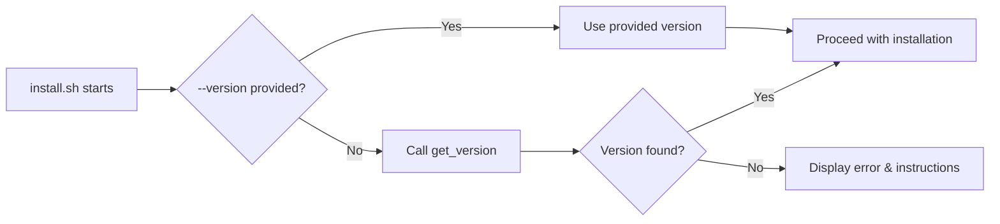

# Dynamic Version Management from Git Tags - Implementation Plan

## Overview

This plan describes how to automate version extraction from Git tags across all installer scripts, eliminating hard-coded version numbers while maintaining robust fallback mechanisms. The solution follows **DRY (Don't Repeat Yourself)** and **SRP (Single Responsibility Principle)** to create maintainable, testable components.

## Design Principles

### DRY (Don't Repeat Yourself)
- Each function exists in exactly one place
- Shared logic is extracted to reusable libraries
- No duplicated version detection, translation compilation, or packaging logic

### SRP (Single Responsibility Principle)
- Each library module has exactly one reason to change
- Scripts are thin orchestrators that compose library functions
- Clear separation of concerns between detection, compilation, packaging, and installation

## Current State

### Build System (Working Model)
- **Location:** [`.vscode/tasks.json`](.vscode/tasks.json:27)
- **Method:** `APP_VERSION=$(git describe --tags); export APP_VERSION; exec ... -DAPP_VERSION=\"$APP_VERSION\" ...`
- **Usage:** [`options.hpp`](options.hpp:119-126) extracts semantic version with regex: `(?:^|-|n|v|V)([0-9]+\.[0-9]+\.[0-9]+)`

### Installer Scripts (Hard-coded)
- [`install.sh`](midiplay-installer/install.sh:16): `PACKAGE_VERSION="1.5.7"`
- [`create-installer-archive.sh`](create-installer-archive.sh:12): `VERSION="1.5.7"`
- [`update-installer-package.sh`](update-installer-package.sh:67): Fallback `"1.5.7"` (has `--version` flag)

## Solution Architecture

### Library Structure (Single Responsibility Modules)

All shared logic is extracted into focused, single-purpose library modules:

```
lib/
├── version.sh        # Version detection and extraction
├── translations.sh   # Translation compilation (.po → .mo)
├── packaging.sh      # Archive creation (tar.gz, zip)
├── metadata.sh       # Version metadata updates (control files, scripts)
└── validation.sh     # Package structure validation
```

### Library Responsibilities

| Library | Responsibility | Reason to Change |
|---------|---------------|------------------|
| `version.sh` | Detect version from Git tags, .VERSION file, binary, or directory | Version detection strategy changes |
| `translations.sh` | Compile .po files to .mo binaries | Translation tooling or process changes |
| `packaging.sh` | Create distributable archives | Archive format requirements change |
| `metadata.sh` | Update version strings in various files | Metadata file formats change |
| `validation.sh` | Verify package completeness | Required files or structure changes |

### Core Component: version.sh

This library implements a four-tier fallback strategy for version detection:

```bash
# Function: get_version
# Returns: Semantic version string (X.Y.Z)
# Exit code: 0 on success, 1 on failure

get_version() {
    local provided_version="$1"  # Optional: --version override
    local version=""
    
    # Tier 0: Manual override (highest priority)
    if [[ -n "$provided_version" ]]; then
        echo "$provided_version"
        return 0
    fi
    
    # Tier 1: Git tags (development environment)
    if command -v git &> /dev/null && [[ -d .git ]]; then
        local git_version=$(git describe --tags 2>/dev/null)
        if [[ -n "$git_version" ]]; then
            version=$(extract_semantic_version "$git_version")
            if [[ -n "$version" ]]; then
                echo "$version"
                return 0
            fi
        fi
    fi
    
    # Tier 2: .VERSION file (distributed archives)
    if [[ -f ".VERSION" ]]; then
        version=$(cat ".VERSION" | head -1)
        if [[ -n "$version" ]]; then
            echo "$version"
            return 0
        fi
    fi
    
    # Tier 3: Extract from binary (if available)
    if [[ -f "debian-package/usr/local/bin/play" ]]; then
        version=$(strings "debian-package/usr/local/bin/play" 2>/dev/null | \
                  grep -E '^[0-9]+\.[0-9]+\.[0-9]+$' | head -1)
        if [[ -n "$version" ]]; then
            echo "$version"
            return 0
        fi
    fi
    
    # Tier 4: Parse from parent directory name
    local parent_dir=$(basename "$(pwd)")
    if [[ "$parent_dir" =~ midiplay-installer-v([0-9]+\.[0-9]+\.[0-9]+) ]]; then
        echo "${BASH_REMATCH[1]}"
        return 0
    fi
    
    # All fallbacks failed
    return 1
}

# Helper function to extract semantic version from git describe output
extract_semantic_version() {
    local git_output="$1"
    # Match pattern from options.hpp: (?:^|-|n|v|V)([0-9]+\.[0-9]+\.[0-9]+)
    if [[ "$git_output" =~ (^|-|n|v|V)([0-9]+\.[0-9]+\.[0-9]+) ]]; then
        echo "${BASH_REMATCH[2]}"
        return 0
    fi
    return 1
}
```

### Component: translations.sh

Handles all translation-related operations:

```bash
#!/bin/bash
# lib/translations.sh - Translation compilation (Single Responsibility)

compile_translations() {
    local package_locale_dir="${1:-midiplay-installer/debian-package/usr/share/locale}"
    
    if [[ ! -f "./po/compile-translations.sh" ]]; then
        echo "⚠️  Translation compilation script not found"
        return 1
    fi
    
    # Compile all .po files
    if ! ./po/compile-translations.sh; then
        echo "⚠️  Translation compilation failed"
        return 1
    fi
    
    # Copy compiled .mo files to package structure
    local count=0
    for lang_dir in po/*/LC_MESSAGES; do
        if [[ -d "$lang_dir" && -f "$lang_dir/midiplay.mo" ]]; then
            local lang=$(basename $(dirname "$lang_dir"))
            mkdir -p "$package_locale_dir/$lang/LC_MESSAGES"
            cp "$lang_dir/midiplay.mo" "$package_locale_dir/$lang/LC_MESSAGES/"
            ((count++))
        fi
    done
    
    echo "✅ Installed $count translation(s)"
    return 0
}
```

### Component: packaging.sh

Handles archive creation:

```bash
#!/bin/bash
# lib/packaging.sh - Archive creation (Single Responsibility)

create_archives() {
    local version="$1"
    local base_name="midiplay-installer"
    local archive_dir="${2:-midiplay-installer}"
    
    if [[ ! -d "$archive_dir" ]]; then
        echo "❌ Error: $archive_dir directory not found"
        return 1
    fi
    
    # Create tar.gz archive
    local tar_file="${base_name}-v${version}.tar.gz"
    if tar -czf "$tar_file" "$archive_dir/"; then
        echo "✅ Created: $tar_file ($(du -h "$tar_file" | cut -f1))"
    else
        echo "❌ Failed to create tar.gz archive"
        return 1
    fi
    
    # Create zip archive
    local zip_file="${base_name}-v${version}.zip"
    if zip -r "$zip_file" "$archive_dir/" > /dev/null; then
        echo "✅ Created: $zip_file ($(du -h "$zip_file" | cut -f1))"
    else
        echo "❌ Failed to create zip archive"
        return 1
    fi
    
    return 0
}
```

### Component: metadata.sh

Handles version string updates in various files:

```bash
#!/bin/bash
# lib/metadata.sh - Metadata updates (Single Responsibility)

update_control_version() {
    local version="$1"
    local control_file="${2:-midiplay-installer/debian-package/DEBIAN/control}"
    
    if [[ ! -f "$control_file" ]]; then
        echo "❌ Control file not found: $control_file"
        return 1
    fi
    
    sed -i "s/^Version:.*/Version: $version/" "$control_file"
    echo "✅ Updated DEBIAN/control to version $version"
    return 0
}

update_install_script_version() {
    local version="$1"
    local install_script="${2:-midiplay-installer/install.sh}"
    
    if [[ ! -f "$install_script" ]]; then
        echo "⚠️  Install script not found: $install_script"
        return 1
    fi
    
    sed -i "s/^PACKAGE_VERSION=.*/PACKAGE_VERSION=\"$version\"/" "$install_script"
    echo "✅ Updated install.sh to version $version"
    return 0
}

create_version_file() {
    local version="$1"
    local version_file="${2:-midiplay-installer/.VERSION}"
    
    echo "$version" > "$version_file"
    echo "✅ Created .VERSION file: $version"
    return 0
}
```

### Component: validation.sh

Validates package structure:

```bash
#!/bin/bash
# lib/validation.sh - Package validation (Single Responsibility)

validate_package_structure() {
    local package_dir="${1:-midiplay-installer}"
    local errors=0
    
    # Required files
    local required_files=(
        "$package_dir/install.sh"
        "$package_dir/uninstall.sh"
        "$package_dir/README.md"
        "$package_dir/debian-package/DEBIAN/control"
        "$package_dir/debian-package/usr/local/bin/play"
        "$package_dir/debian-package/etc/midiplay/midi_devices.yaml"
    )
    
    echo "🔍 Validating package structure..."
    
    for file in "${required_files[@]}"; do
        if [[ ! -f "$file" ]]; then
            echo "❌ Missing: $file"
            ((errors++))
        fi
    done
    
    # Check for translations (warning only)
    if [[ ! -d "$package_dir/debian-package/usr/share/locale" ]]; then
        echo "⚠️  No translations found (this is optional but recommended)"
    else
        local translation_count=$(find "$package_dir/debian-package/usr/share/locale" -name "*.mo" | wc -l)
        echo "✅ Found $translation_count translation file(s)"
    fi
    
    if [[ $errors -gt 0 ]]; then
        echo "❌ Package validation failed with $errors error(s)"
        return 1
    fi
    
    echo "✅ Package structure is valid"
    return 0
}
```

## Script Orchestrators

Scripts become thin orchestrators that compose library functions:

### Implementation: update-installer-package.sh

**Purpose:** Update installer package after building a new binary

**Orchestration:**
```bash
#!/bin/bash
# update-installer-package.sh - Binary update workflow orchestrator

set -e

# Source required libraries
SCRIPT_DIR="$(cd "$(dirname "${BASH_SOURCE[0]}")" && pwd)"
source "$SCRIPT_DIR/lib/version.sh"
source "$SCRIPT_DIR/lib/translations.sh"
source "$SCRIPT_DIR/lib/metadata.sh"
source "$SCRIPT_DIR/lib/packaging.sh"

# [Argument parsing code here - similar to current implementation]

main() {
    echo "🔄 Updating installer package..."
    
    # 1. Detect version (from Git, --version flag, or fallbacks)
    VERSION=$(get_version "$PROVIDED_VERSION")
    echo "📌 Using version: $VERSION"
    
    # 2. Copy binary (inline - specific to this script)
    echo "📦 Updating binary..."
    cp "$BINARY_PATH" "$BINARY_DEST"
    chmod 755 "$BINARY_DEST"
    
    # 3. Compile and install translations
    compile_translations
    
    # 4. Update metadata files
    update_control_version "$VERSION"
    update_install_script_version "$VERSION"
    create_version_file "$VERSION"
    
    # 5. Optionally create archives
    if [[ "$CREATE_ARCHIVES" == true ]]; then
        create_archives "$VERSION"
    fi
    
    echo "✅ Package update completed!"
}

main "$@"
```

### Implementation: create-installer-archive.sh

**Changes Required:**
- Add `--version` command-line option support (similar to `update-installer-package.sh`)
- Replace `PACKAGE_VERSION="1.5.7"` with call to `get_version`
- Add error handling for version detection failure

**Command-line interface:**
```bash
./install.sh [--version X.Y.Z]
```

**Version Resolution Flow:**


**Purpose:** Create distributable archives from prepared installer directory

**Orchestration:**
```bash
#!/bin/bash
# create-installer-archive.sh - Archive creation workflow orchestrator

set -e

# Source required libraries
SCRIPT_DIR="$(cd "$(dirname "${BASH_SOURCE[0]}")" && pwd)"
source "$SCRIPT_DIR/lib/version.sh"
source "$SCRIPT_DIR/lib/validation.sh"
source "$SCRIPT_DIR/lib/packaging.sh"

# [Argument parsing code here]

main() {
    echo "📦 Creating installer archives..."
    
    # 1. Detect version
    VERSION=$(get_version "$PROVIDED_VERSION")
    echo "📌 Using version: $VERSION"
    
    # 2. Validate package structure
    validate_package_structure
    
    # 3. Update .VERSION file (ensures it's current)
    create_version_file "$VERSION"
    
    # 4. Create archives
    create_archives "$VERSION"
    
    echo "✅ Archives created successfully!"
}

main "$@"
```

**Key improvement:** Now validates structure (including translations) before archiving!

### Implementation: install.sh

**Changes Required:**
- Replace `VERSION="1.5.7"` with call to `get_version`
- **NEW:** Create `.VERSION` file in `midiplay-installer/` directory
- Update archive naming to use detected version
- Add error handling for version detection

**Critical Addition:**
```bash
# After detecting version, write it to .VERSION file for distribution
echo "$VERSION" > midiplay-installer/.VERSION
```

**Purpose:** When archives are extracted by end users, they won't have Git access, but the `.VERSION` file will be included in the archive.

**Purpose:** Install the package on the target system

**Orchestration:**
```bash
#!/bin/bash
# midiplay-installer/install.sh - Installation workflow orchestrator

set -e

# Try to source version library if available (development environment)
# Otherwise use inline fallback (distributed environment)
if [[ -f "../lib/version.sh" ]]; then
    source "../lib/version.sh"
else
    # Inline version detection for distributed archives
    get_version() {
        local provided_version="$1"
        
        # Tier 0: Manual override
        [[ -n "$provided_version" ]] && echo "$provided_version" && return 0
        
        # Tier 1: .VERSION file (most common for distributed archives)
        [[ -f ".VERSION" ]] && cat ".VERSION" | head -1 && return 0
        
        # Tier 2: Extract from binary
        if [[ -f "debian-package/usr/local/bin/play" ]]; then
            local ver=$(strings "debian-package/usr/local/bin/play" 2>/dev/null | \
                       grep -E '^[0-9]+\.[0-9]+\.[0-9]+$' | head -1)
            [[ -n "$ver" ]] && echo "$ver" && return 0
        fi
        
        # Tier 3: Parse from parent directory
        local parent=$(basename "$(dirname "$(pwd)")")
        if [[ "$parent" =~ midiplay-installer-v([0-9]+\.[0-9]+\.[0-9]+) ]]; then
            echo "${BASH_REMATCH[1]}" && return 0
        fi
        
        return 1
    fi
fi

# [Argument parsing code here - add --version support]

main() {
    echo "🎹 Installing Organ Pi MIDI Player..."
    
    # 1. Detect version
    VERSION=$(get_version "$PROVIDED_VERSION")
    if [[ $? -ne 0 ]]; then
        echo "❌ Unable to detect version automatically"
        echo "Please run: ./install.sh --version X.Y.Z"
        exit 1
    fi
    
    echo "📌 Installing version: $VERSION"
    
    # 2. Build .deb package (inline - specific to installation)
    PACKAGE_NAME="midiplay"
    PACKAGE_ARCH="arm64"
    DEB_FILE="${PACKAGE_NAME}_${VERSION}_${PACKAGE_ARCH}.deb"
    
    dpkg-deb --build debian-package "$DEB_FILE"
    
    # 3. Install package
    sudo dpkg -i "$DEB_FILE"
    
    echo "✅ Installation completed!"
}

main "$@"
```

**Changes Required:**
- Improve `get_version()` function (lines 38-68) to use new four-tier strategy
- Already has `--version` flag support ✅
- Update `.VERSION` file after version detection
- Remove fallback to control file parsing (line 58-63)

### File Structure After Implementation

```
midiplay/
├── .git/                           # Git repository (dev only)
├── lib/                            # NEW: Shared library modules (SRP-compliant)
│   ├── version.sh                  # Version detection logic
│   ├── translations.sh             # Translation compilation
│   ├── packaging.sh                # Archive creation
│   ├── metadata.sh                 # Metadata updates
│   └── validation.sh               # Package validation
├── create-installer-archive.sh     # Thin orchestrator
├── update-installer-package.sh     # Thin orchestrator
└── midiplay-installer/
    ├── .VERSION                    # Created during archive packaging
    ├── install.sh                  # Can source ../lib/ or use inline fallback
    ├── uninstall.sh
    ├── README.md
    └── debian-package/
        ├── DEBIAN/
        │   └── control             # Version updated by metadata.sh
        ├── usr/local/bin/play      # Binary with embedded version
        └── usr/share/locale/       # Translations (compiled by translations.sh)
            └── */LC_MESSAGES/*.mo
```

### Workflow Scenarios

#### Scenario A: Development Build
```bash
$ ./create-installer-archive.sh
# Tier 1: Detects git tag v1.6.0
# Creates midiplay-installer/.VERSION with "1.6.0"
# Creates midiplay-installer-v1.6.0.tar.gz
```

#### Scenario B: Distributed Installation (No Git)
```bash
$ tar -xzf midiplay-installer-v1.6.0.tar.gz
$ cd midiplay-installer
$ ./install.sh
# Tier 2: Reads .VERSION file → "1.6.0"
# Builds package: midiplay_1.6.0_arm64.deb
```

#### Scenario C: Manual Override
```bash
$ ./install.sh --version 1.6.0-custom
# Tier 0: Uses provided version
# Builds package: midiplay_1.6.0-custom_arm64.deb
```

#### Scenario D: Recovery from Binary
```bash
$ cd midiplay-installer
$ rm .VERSION  # Simulate missing file
$ ./install.sh
# Tier 3: Extracts version from play binary
# Proceeds with installation
```

## Implementation Steps

### Phase 1: Create Library Infrastructure (SRP Compliant)
1. Create `lib/` directory
2. Implement `lib/version.sh` (version detection only)
3. Implement `lib/translations.sh` (translation compilation only)
4. Implement `lib/packaging.sh` (archive creation only)
5. Implement `lib/metadata.sh` (metadata updates only)
6. Implement `lib/validation.sh` (package validation only)
7. Add unit tests for each library independently

### Phase 2: Refactor Scripts (DRY Compliant)
1. Refactor `update-installer-package.sh`
   - Source all required libraries
   - Remove duplicated code (now in libraries)
   - Become thin orchestrator
   - Keep existing `--version` flag support

2. Refactor `create-installer-archive.sh`
   - Source required libraries (version, validation, packaging)
   - Remove duplicated code
   - Add version file creation
   - Add `--version` flag support
   - **Fix:** Now validates translations before archiving

3. Update `install.sh`
   - Add command-line argument parsing
   - Add `--version` flag support
   - Use inline version detection fallback (for distributed archives)
   - Optionally source `../lib/version.sh` if in dev environment

### Phase 3: Update Documentation
1. Update `README.md` with new workflow
2. Update `UPDATE-PACKAGE-GUIDE.md` with library structure
3. Create `lib/README.md` explaining each library's purpose
4. Update release process documentation

### Phase 4: Testing Strategy
1. **Unit Tests:** Test each library function independently
2. **Integration Tests:** Test script orchestration
3. **Scenario Tests:**
   - Development environment (with Git)
   - Distributed archives (no Git, with .VERSION)
   - Manual version override (`--version` flag)
   - Each fallback tier independently
   - Missing translations warning
   - Corrupted .VERSION file handling

### Phase 5: Validation
1. Run through complete release workflow
2. Verify archive completeness (including translations)
3. Test installation on clean system
4. Verify version consistency across all components

## Error Handling Strategy

### When Version Detection Fails

Display comprehensive error message:
```
❌ Error: Unable to detect version automatically.

Attempted:
  ✗ Git tags (git not available or no tags found)
  ✗ .VERSION file (file not found)
  ✗ Binary extraction (binary not found or no version string)
  ✗ Directory name parsing (directory name doesn't match pattern)

Solutions:
  1. Provide version manually: ./install.sh --version X.Y.Z
  2. Ensure you're in the midiplay-installer directory
  3. Check that the package structure is complete

For help, see: https://github.com/your-repo/wiki/installation
```

## Backward Compatibility

### Archive Naming
- Old: `midiplay-installer-v1.5.7.tar.gz` ✅ (maintained)
- New: `midiplay-installer-v1.6.0.tar.gz` ✅ (same pattern)

### Package Naming
- Old: `midiplay_1.5.7_arm64.deb` ✅ (maintained)
- New: `midiplay_1.6.0_arm64.deb` ✅ (same pattern)

### Manual Version Specification
- All scripts support `--version` flag for override

## Benefits

1. **Single Source of Truth:** Git tags control all versioning
2. **Reduced Maintenance:** No need to update multiple version strings
3. **Consistency:** Build binary and installer always use same version
4. **Flexibility:** Multiple fallback tiers handle edge cases
5. **Developer Friendly:** Works seamlessly in development
6. **Distribution Friendly:** Works in distributed archives without Git

## Risks & Mitigations

| Risk | Mitigation |
|------|------------|
| Git not available in dev environment | Tier 2-4 fallbacks + manual override |
| .VERSION file corrupted/missing | Tier 3-4 fallbacks + manual override |
| Binary doesn't contain version | Tier 4 fallback + manual override |
| Directory renamed by user | Manual override flag + helpful error |
| Shallow Git clone (CI/CD) | Ensure `git fetch --tags` in CI pipeline |

## Future Enhancements

1. **Validation:** Add version format validation (semantic versioning check)
2. **Logging:** Add `--verbose` flag to show which tier was used
3. **Caching:** Cache detected version to avoid repeated Git calls
4. **CI/CD Integration:** Add GitHub Actions workflow to auto-create releases

## References

- Current build system: [`.vscode/tasks.json`](.vscode/tasks.json:23-61)
- Version extraction logic: [`options.hpp`](options.hpp:118-126)
- Existing version override: [`update-installer-package.sh`](update-installer-package.sh:125-127)