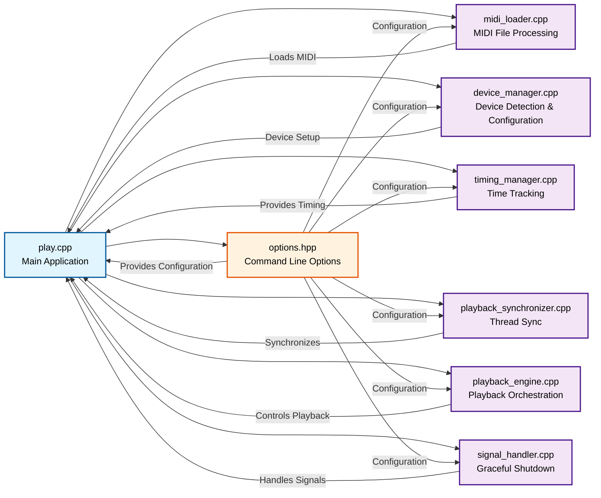

# MIDIPlay Component Block Diagram

## Component Descriptions

### Main Application
- **play.cpp**: Entry point that orchestrates all components and manages the application flow

### Configuration
- **options.hpp**: Handles command-line argument parsing and provides configuration to other components

### Core Components (.cpp files)
- **device_manager.cpp**: Handles MIDI device detection, connection, and configuration
- **playback_engine.cpp**: Orchestrates MIDI playback including introduction, verses, and musical directions
- **timing_manager.cpp**: Tracks elapsed time and provides timing information
- **playback_synchronizer.cpp**: Provides thread synchronization for playback control
- **signal_handler.cpp**: Manages graceful shutdown on SIGINT (Ctrl+C) with emergency notes-off
- **midi_loader.cpp**: Responsible for loading, parsing, and extracting metadata from MIDI files